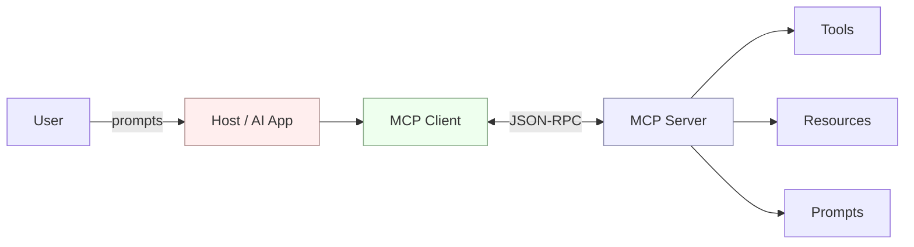
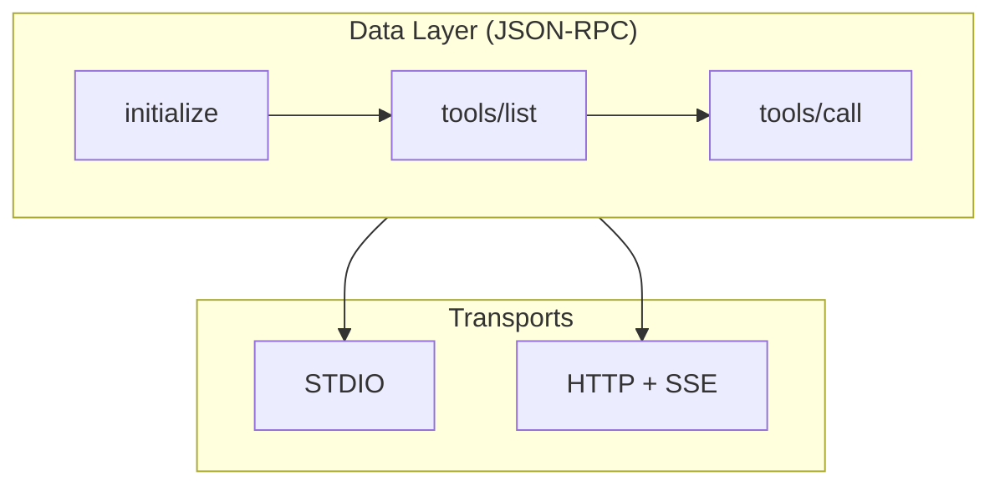
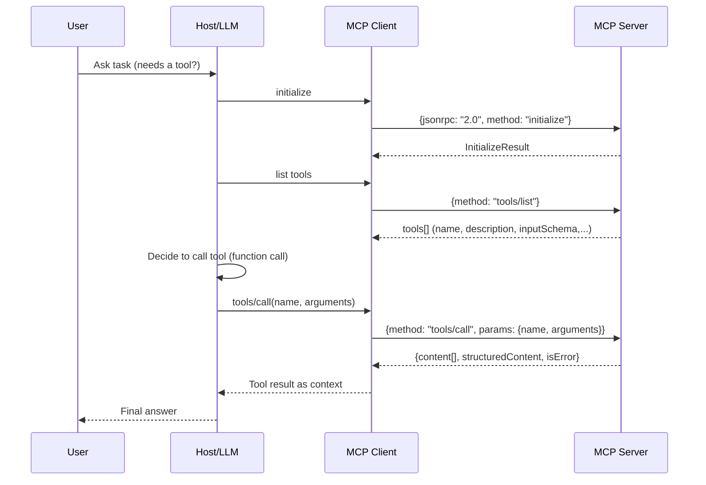
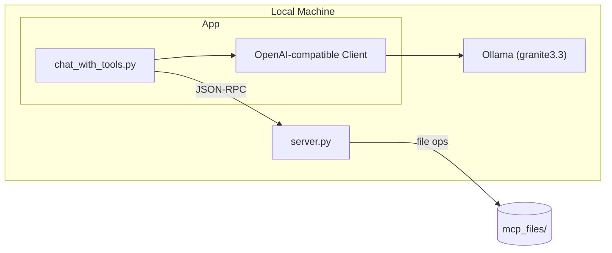
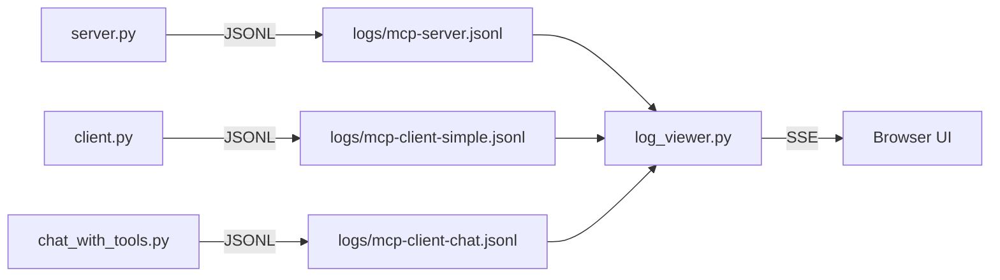
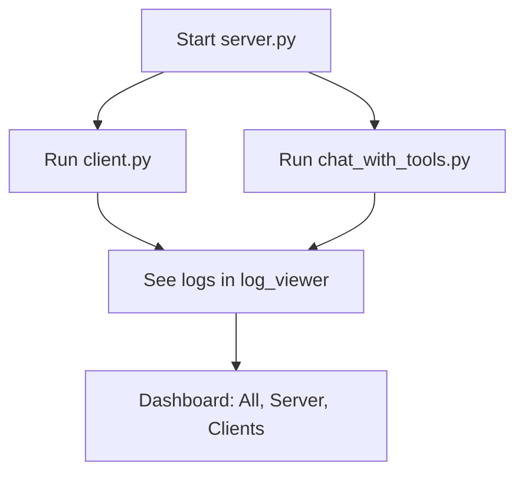

# Understanding the Model Context Protocol (MCP) and its Relation to AI Tool Calls and Agent-to-Agent (A2A) Communication

## Introduction – What this section is about and why it matters

The **Model Context Protocol (MCP)** is an open standard for connecting AI models and agents to external tools, data sources, and workflows in a consistent way. Originally introduced by Anthropic in late 2024, MCP has quickly gained industry-wide support – even “rival” OpenAI and other major companies (AWS, GitHub, Microsoft, etc.) have adopted it as a standard. MCP acts like a *“virtual operating system” for AI*, or as the official analogy goes, *“a USB-C port for AI applications,”* providing a universal interface for an AI to access various external capabilities.

**Why MCP?** Modern AI models (LLMs) are powerful but have limitations: they lack direct access to real-time data, personal or proprietary information, and the ability to take actions in the world. Before MCP, integrating an AI with external tools or data was done in bespoke ways (each AI platform had its own plugins or API integrations). This led to a complex **N×M problem**: **N** AI systems each needing custom integration with **M** different tools, resulting in redundant effort and fragile, fragmented solutions. MCP addresses this by **standardizing how AI agents discover and use tools**, analogous to how USB or REST APIs standardized device and web service integrations.

In this comprehensive guide, you’ll get a deep dive into **how MCP works**, including its architecture, workflow, and how to implement a simple MCP server/client. We’ll then explain how MCP relates to traditional AI *“tool calls”* (function calling in LLMs) and how it differs from **Agent-to-Agent (A2A)** communication. You’ll see technical examples (with Python code) and diagram descriptions to make the concepts clear.


## Overview of the Model Context Protocol (MCP) – What MCP is at a high level and the elements it standardizes

MCP is a standardized protocol that defines how an AI application (the *host*) can connect to external systems through a uniform **client–server interface**. The goal is to give AI models **structured access** to tools, data, and context they need, on-demand and in a model-agnostic way.

**Key characteristics of MCP – the important properties to understand:**

* **Open and Cross-Vendor** – MCP began with Anthropic but is an open standard now supported by multiple AI providers including OpenAI. This means an MCP-compliant server (tool or data source) can be used by any MCP-aware AI agent, regardless of the vendor.

* **JSON-RPC Based** – MCP uses JSON-RPC 2.0 as the underlying message format for requests and responses. All interactions – from listing available tools to calling a function – are standardized JSON messages, which makes implementations language-agnostic.

* **Standard Primitives** – MCP defines the core interaction types:

  * **Tools** – operations or actions the server can perform on behalf of the AI (think: functions the AI can invoke).
  * **Resources** – read-only data or documents the server can provide as context (e.g., files, database records).
  * **Prompts** – preset prompt templates or instructions that can be shared to standardize interactions.
  * **Notifications** – server-initiated messages to inform the client of events (updates, progress, etc.).

* **Two-Layer Design** – MCP separates *what* is communicated from *how* it’s transported:

  * **Data layer** – the inner JSON-RPC message structure and semantics (methods for initialization, tool use, etc.).
  * **Transport layer** – the channel carrying those messages (STDIO or HTTP/SSE).

**Why this matters – the practical impact for teams:**

* **For Developers** – **Less custom glue code**; integrate once using MCP’s standards instead of writing different adapters per AI or per tool.

* **For AI Applications** – **Access to a growing ecosystem of tools and data** (hundreds of MCP servers already exist) without bespoke integration.

* **For End Users** – **Smarter, more context-aware assistants** that can securely access your data or perform tasks on your behalf.


## MCP Client-Server Architecture and Components – How hosts, clients, and servers fit together and why this split is useful



### MCP layers in practice – How data and transport are combined in real deployments



## MCP Workflow: Initialization to Tool Usage – A step-by-step view of the handshake and a typical tool call



### Optional: Chat with tools via local Ollama (Granite 3.3)



### Logging and Real-time Log Viewer



### Wiring Guide: How everything fits together (server, clients, LLM, logs)




## Implementing a Simple MCP Server and Client in Python – A practical example that you can run locally

This section builds a minimal **File Management MCP server** and a matching **MCP client** in Python. The server exposes tools to list/read/write/delete files and search within a file. The client demonstrates the handshake, discovery, and two tool calls.

### Python MCP Server (HTTP transport) – A small Flask-based JSON-RPC endpoint and why it’s structured this way

We’ll expose a POST `/rpc` endpoint handling `initialize`, `tools/list`, and `tools/call`. The server maintains a sandbox directory for operations. This mirrors how an HTTP-transport MCP server behaves. (A local STDIO server would exchange the *same JSON* via stdin/stdout.)

```python
from flask import Flask, request, jsonify
import os, json

app = Flask(__name__)
BASE_DIR = "./mcp_files"  # directory used by this server for file operations
os.makedirs(BASE_DIR, exist_ok=True)

# Define tool definitions (name, description, schemas)
TOOLS = {
    "list_files": {
        "description": "List all files in the directory",
        "inputSchema": {"type": "object", "properties": {}, "required": []},
        "outputSchema": {"type": "object", "properties": {
            "files": {"type": "array", "items": {"type": "string"}}
        }, "required": ["files"]}
    },
    "read_file": {
        "description": "Read the contents of a file",
        "inputSchema": {"type": "object", "properties": {
            "filename": {"type": "string"}
        }, "required": ["filename"]},
        "outputSchema": {"type": "object", "properties": {
            "content": {"type": "string"}
        }, "required": ["content"]}
    },
    "write_file": {
        "description": "Write text to a file (creates or overwrites)",
        "inputSchema": {"type": "object", "properties": {
            "filename": {"type": "string"},
            "text": {"type": "string"}
        }, "required": ["filename", "text"]},
        "outputSchema": {"type": "object", "properties": {
            "message": {"type": "string"}
        }, "required": ["message"]}
    },
    "delete_file": {
        "description": "Delete a file by name",
        "inputSchema": {"type": "object", "properties": {
            "filename": {"type": "string"}
        }, "required": ["filename"]},
        "outputSchema": {"type": "object", "properties": {
            "deleted": {"type": "boolean"}
        }, "required": ["deleted"]}
    },
    "search_file": {
        "description": "Search for a keyword in a file and count occurrences",
        "inputSchema": {"type": "object", "properties": {
            "filename": {"type": "string"},
            "keyword": {"type": "string"}
        }, "required": ["filename", "keyword"]},
        "outputSchema": {"type": "object", "properties": {
            "count": {"type": "integer"}
        }, "required": ["count"]}
    }
}

# Helper functions for each tool
def list_files():
    files = os.listdir(BASE_DIR)
    return {"files": files}

def read_file(filename):
    filepath = os.path.join(BASE_DIR, filename)
    if not os.path.isfile(filepath):
        raise FileNotFoundError(f"{filename} not found")
    with open(filepath, 'r') as f:
        content = f.read()
    return {"content": content}

def write_file(filename, text):
    filepath = os.path.join(BASE_DIR, filename)
    with open(filepath, 'w') as f:
        f.write(text)
    return {"message": f"Wrote {len(text)} bytes to {filename}"}

def delete_file(filename):
    filepath = os.path.join(BASE_DIR, filename)
    if os.path.isfile(filepath):
        os.remove(filepath)
        deleted = True
    else:
        deleted = False
    return {"deleted": deleted}

def search_file(filename, keyword):
    filepath = os.path.join(BASE_DIR, filename)
    if not os.path.isfile(filepath):
        raise FileNotFoundError(f"{filename} not found")
    count = 0
    with open(filepath, 'r') as f:
        for line in f:
            if keyword in line:
                count += 1
    return {"count": count}

# Map tool names to functions for execution
TOOL_FUNCTIONS = {
    "list_files": lambda params: list_files(),
    "read_file":  lambda params: read_file(params.get("filename")),
    "write_file": lambda params: write_file(params.get("filename"), params.get("text")),
    "delete_file": lambda params: delete_file(params.get("filename")),
    "search_file": lambda params: search_file(params.get("filename"), params.get("keyword"))
}

@app.route("/rpc", methods=["POST"])
def rpc():
    req = request.get_json(force=True)
    if req is None:
        return jsonify({"jsonrpc": "2.0", "error": {"code": -32700, "message": "Parse error"}})
    jsonrpc = req.get("jsonrpc", "2.0")
    method = req.get("method")
    req_id = req.get("id")
    # Handle 'initialize'
    if method == "initialize":
        response = {
            "protocolVersion": "2025-06-18",
            "capabilities": {
                "tools": {"listChanged": False},
                "resources": {"subscribe": False, "listChanged": False},
                "prompts": {"listChanged": False}
            },
            "serverInfo": {"name": "FileServer", "version": "1.0"}
        }
        return jsonify({"jsonrpc": jsonrpc, "id": req_id, "result": response})
    # Handle 'tools/list'
    if method == "tools/list":
        tools_list = []
        for name, meta in TOOLS.items():
            tools_list.append({
                "name": name,
                "description": meta["description"],
                "inputSchema": meta["inputSchema"],
                "outputSchema": meta["outputSchema"]
            })
        return jsonify({"jsonrpc": jsonrpc, "id": req_id, "result": {"tools": tools_list}})
    # Handle 'tools/call'
    if method == "tools/call":
        params = req.get("params", {})
        tool_name = params.get("name")
        args = params.get("arguments", {})
        if tool_name in TOOL_FUNCTIONS:
            try:
                result_data = TOOL_FUNCTIONS[tool_name](args)
                content_item = {"type": "text", "text": str(result_data)}
                response = {
                    "content": [content_item],
                    "structuredContent": result_data,
                    "isError": False
                }
                return jsonify({"jsonrpc": jsonrpc, "id": req_id, "result": response})
            except Exception as e:
                error_msg = str(e)
                return jsonify({"jsonrpc": jsonrpc, "id": req_id,
                                "error": {"code": 1, "message": error_msg}})
        else:
            return jsonify({"jsonrpc": jsonrpc, "id": req_id,
                            "error": {"code": 404, "message": f"Tool '{tool_name}' not found"}})
    # If method is not recognized
    return jsonify({"jsonrpc": jsonrpc, "id": req_id,
                    "error": {"code": -32601, "message": "Method not found"}})

# (Optional) SSE heartbeat endpoint for demonstration
@app.route("/events")
def events():
    return app.response_class(
        "data: {\"event\": \"heartbeat\"}\n\n", mimetype="text/event-stream"
    )
```

**Implementation notes – what to notice in the server code:**

* **Tool metadata** – defined up front; in production, you can generate these schemas from type hints (e.g., via FastMCP).

* **`initialize`** – returns protocol version, capabilities (tools/resources/prompts), and `serverInfo`.

* **`tools/list`** – returns each tool’s **`name`**, **`description`**, **`inputSchema`**, **`outputSchema`**.

* **`tools/call`** – dispatches to Python functions, returns both human-readable **`content`** and machine-readable **`structuredContent`**, with **`isError`** flag.

* **Transport** – HTTP here; a STDIO version would exchange the same JSON via stdin/stdout loop.

### Python MCP Client (HTTP transport) – A minimal connector that shows the handshake, discovery, and calls

The client simulates a host-side MCP connector. It **initializes**, **lists tools**, and **calls** two tools using JSON-RPC over HTTP.

```python
import requests
import json

MCP_SERVER_URL = "http://localhost:5000/rpc"  # our MCP server endpoint

# Step 1: Initialize connection
init_payload = {
    "jsonrpc": "2.0",
    "id": 1,
    "method": "initialize",
    "params": {
        "protocolVersion": "2025-06-18",
        "capabilities": {},
        "clientInfo": {"name": "ExampleClient", "version": "0.1"}
    }
}
print(">> Sending initialize")
response = requests.post(MCP_SERVER_URL, json=init_payload).json()
print("<< Received init response:", response, "\n")

# Step 2: List available tools
tools_list_payload = {
    "jsonrpc": "2.0",
    "id": 2,
    "method": "tools/list",
    "params": None
}
print(">> Requesting tools list")
response = requests.post(MCP_SERVER_URL, json=tools_list_payload).json()
tools = response.get("result", {}).get("tools", [])
print("<< Available tools:", json.dumps(tools, indent=2), "\n")

# For demonstration, let's call a couple of tools:
tool_names = {t['name'] for t in tools}
if "write_file" in tool_names and "search_file" in tool_names:
    # Step 3: Call write_file
    write_payload = {
        "jsonrpc": "2.0",
        "id": 3,
        "method": "tools/call",
        "params": {
            "name": "write_file",
            "arguments": {"filename": "demo.txt", "text": "Hello\nThis is a TODO line.\nBye"}
        }
    }
    print(f">> Calling write_file to create 'demo.txt'")
    response = requests.post(MCP_SERVER_URL, json=write_payload).json()
    print("<< write_file result:", json.dumps(response, indent=2), "\n")
    
    # Step 4: Call search_file on the created file
    search_payload = {
        "jsonrpc": "2.0",
        "id": 4,
        "method": "tools/call",
        "params": {
            "name": "search_file",
            "arguments": {"filename": "demo.txt", "keyword": "TODO"}
        }
    }
    print(">> Calling search_file to find 'TODO' in 'demo.txt'")
    response = requests.post(MCP_SERVER_URL, json=search_payload).json()
    print("<< search_file result:", json.dumps(response, indent=2), "\n")
```

**What this demonstrates – the specific learning takeaways from the client code:**

* **Handshake** – how `initialize` exchanges protocol version/capabilities and identifies client/server.

* **Discovery** – `tools/list` returns metadata sufficient for the host to **surface tools to the LLM** (via prompt augmentation).

* **Invocation** – `tools/call` shows how a model’s function call is translated to MCP, with **schema-validated** arguments and **structured** results.

* **Parity across transports** – switch HTTP to STDIO and the **payloads are identical**; only the I/O mechanism changes.


## Local (STDIO) vs HTTP (Remote) MCP – The differences you’ll encounter and how to choose the right one

This section highlights practical differences between the two common transports when deploying MCP servers.

* **Security model – how identity and trust are handled**
  **STDIO** – **local process trust**; typically launched by the host app, inheriting user’s OS permissions. Good for tools that need local filesystem access.
  **HTTP** – **network perimeter + auth**; supports **API keys, OAuth, mTLS**. Use for SaaS tools, multi-tenant servers, and zero-trust environments.

* **Latency & reliability – what affects performance**
  **STDIO** – minimal overhead, low latency, stable for short calls.
  **HTTP/SSE** – adds network hops; can stream long-running results via SSE; needs retries/timeouts; scales horizontally.

* **Discovery and registration – how the host finds the server**
  **STDIO** – preconfigured command to launch server binary/script; no service registry needed.
  **HTTP** – needs endpoint (URL), credentials, and possibly **service discovery** (DNS, config, registry).

* **Deployment and lifecycle – how you ship and operate the server**
  **STDIO** – bundled with desktop apps/IDEs, versioned alongside host.
  **HTTP** – deployed as microservice with **observability, autoscaling, CI/CD**; good for enterprise integrations.

**Bottom line – a rule of thumb:**
**Use STDIO** for **local, trusted, low-latency** tooling (files, local DBs).
**Use HTTP** for **remote, multi-user, secured** services (SaaS, team/shared tools), or when streaming/scale is needed.


## MCP vs Traditional AI Tool Calls (Function Calling) – How MCP standardizes and extends tool use across vendors

This section clarifies how MCP relates to function-calling (the LLM capability to call developer-defined functions).

* **Without MCP – what the developer experience looks like**
  **Per-vendor integration** – define functions/schemas inside each AI platform’s API; write glue code per vendor; re-describe tools multiple times; limited discovery.

* **With MCP – how the developer experience improves**
  **Standardized discovery and calling** – tools expose **schemas** via `tools/list`; host aggregates and **feeds** them to any LLM backend that supports function calling.
  **Plug-and-play** – same MCP server works with different AIs (Claude, ChatGPT, etc.).
  **Beyond tool calls** – MCP also standardizes **resources** (context data) and **prompts**, not just function invocation.

* **Mental model – a practical analogy**
  **Function calling alone** is like **one-off adapters** per device.
  **MCP** is like a **universal port**: one interface, many compatible devices.

**Key takeaway:** MCP **leverages** function calling but **generalizes and standardizes** it across platforms, enabling an ecosystem of reusable tools and shared infrastructure.


## Agent-to-Agent (A2A) Communication – What it is, how it complements MCP, and where it’s different

**A2A (Agent-to-Agent)** is a protocol for **agents to communicate and collaborate** with each other, irrespective of vendor. If MCP is about an agent using **tools/data**, A2A is about **agents coordinating with other agents**.

* **Multi-agent collaboration – the use case**
  **Problem** – organizations will run many specialized agents; they need to work together.
  **A2A** – provides a **standard, open protocol** (JSON-based; adding gRPC) for agents to advertise capabilities, exchange tasks, and return results securely.

* **Security and trust – why it’s front-and-center**
  **Signed exchanges / security cards** – ensure only trusted agents can delegate/accept tasks.

* **How it differs from MCP – the key contrasts to keep in mind**
  **Scope** – MCP: *Agent ↔ Tool/Data*; A2A: *Agent ↔ Agent*.
  **Entities** – MCP: *tools/resources/prompts*; A2A: *tasks/capabilities/artifacts*.
  **Pattern** – MCP: usually **1↔1** client–server; A2A: **many↔many** agents.
  **Transport** – MCP: **STDIO/HTTP(SSE)**; A2A: **JSON + gRPC** options evolving.
  **Discovery** – MCP: configured per server; A2A: often registry/lookup of agents.

* **How A2A and MCP work together – the combined architecture**
  **A2A** networks the **agents** (delegation/orchestration).
  **MCP** equips each agent with **I/O and memory** (tools/resources).
  *Example*: Agent A (PM) delegates via A2A to Agent B (IT) and Agent C (Finance). B and C use MCP to query DBs/APIs, then respond via A2A. Agent A compiles the final answer.

**Conclusion of this section – the architectural takeaway:** A2A **doesn’t replace** MCP. It sits at a different layer. Together, they enable robust **agentic systems**: **A2A for collaboration**, **MCP for capability access**.


## Conclusion – Bringing it all together and what to expect in real systems

The **Model Context Protocol (MCP)** provides a **universal interface** for AI agents to discover and use tools, data, and prompts. You saw how MCP formalizes the handshake, tool discovery, and tool usage via **JSON-RPC** messages, and you implemented a simple **file server and client** to see it in action. MCP **builds upon** LLM function calling and **standardizes** it across vendors, enabling a growing ecosystem of reusable tools.

Distinct from MCP, **Agent-to-Agent (A2A)** communication focuses on **inter-agent collaboration**. In advanced systems, you will often see **both**: **A2A** to coordinate multiple agents, and **MCP** to give those agents access to the tools and data they need.

As these standards gain adoption (with broad support visible for MCP and the fast-evolving A2A specifications), building AI applications becomes **easier, more interoperable, and more modular**. The emerging pattern is clear: **A2A for agent networking, MCP for agent capabilities**—a combination that lets agents **see more, do more, and work together** in real-world environments.


## Sources – Where the concepts and examples above are drawn from

The information and examples above were drawn from the official MCP documentation and community explanations, as well as industry analyses of MCP’s significance. The interplay between MCP, function calling, and A2A was informed by recent blog posts and standards releases.

---

### Table of Contents (Quick links)
- [Overview of the Model Context Protocol (MCP)](#overview-of-the-model-context-protocol-mcp--what-mcp-is-at-a-high-level-and-the-elements-it-standardizes)
- [MCP Client-Server Architecture](#mcp-client-server-architecture-and-components--how-hosts-clients-and-servers-fit-together-and-why-this-split-is-useful)
- [MCP Workflow](#mcp-workflow-initialization-to-tool-usage--a-step-by-step-view-of-the-handshake-and-a-typical-tool-call)
- [Implementing the Server and Client](#implementing-a-simple-mcp-server-and-client-in-python--a-practical-example-that-you-can-run-locally)
- [Quickstart](#quickstart-run-the-minimal-mcp-playground-http)
- [Chat with Tools via Ollama](#optional-chat-with-tools-via-local-ollama-granite-33)
- [How the LLM Calls MCP Tools (Step-by-step)](#how-the-llm-calls-mcp-tools-step-by-step)
- [Common Pitfalls and Debugging](#common-pitfalls-and-debugging)
- [Extensions and Next Steps](#extensions-and-next-steps)

### Wiring Guide: How everything fits together (server, clients, LLM, logs)

This section shows how to run the pieces end-to-end and what each does.

1) Start the MCP-style server (HTTP JSON-RPC)
```bash
uv run python server.py
```
- Exposes `POST /rpc` implementing `initialize`, `tools/list`, `tools/call`.
- Writes logs to `logs/mcp-server.jsonl`.

2) Option A: Run the simple client (no LLM)
```bash
uv run python client.py
```
- Calls `initialize` → `tools/list` → `write_file` → `search_file`.
- Logs to `logs/mcp-client-simple.jsonl`.

3) Option B: Run the tool-using chat (LLM via Ollama)
```bash
ollama serve &
ollama pull granite3.3
uv run python chat_with_tools.py
```
- Discovers MCP tools and maps them to function-calling schema.
- Sends chat messages to Ollama’s OpenAI-compatible API.
- If the model returns `tool_calls`, executes them via MCP `tools/call`, then returns results for the final answer.
- Logs to `logs/mcp-client-chat.jsonl`.

4) View logs in real time
```bash
uv run python log_viewer.py
```
- Basic view: `http://127.0.0.1:5050/` — choose files, add filters (e.g., `component=mcp-server`).
- Dashboard view: `http://127.0.0.1:5050/dashboard` — three panels:
  - All logs (merged)
  - Server logs only
  - Client logs only (simple + chat)
- Filters are simple `key=value` pairs (comma-separated).

What talks to what
- `client.py` and `chat_with_tools.py` POST JSON-RPC to `server.py:/rpc`.
- `chat_with_tools.py` also talks to `ollama` at `http://127.0.0.1:11434/v1`.
- All three components write JSONL logs under `./logs`, which `log_viewer.py` tails and streams via SSE.

Recommended order to try
- Run `server.py`, then `client.py` to verify tool calls.
- Start `log_viewer.py` and open `/dashboard` to watch logs.
- Run `chat_with_tools.py` and ask it to use tools (e.g., create and search a file). Observe the LLM’s `tool_calls` and MCP results in the dashboard.

### How the LLM Calls MCP Tools (Step-by-step)
This section explains, in concrete Python terms, how `chat_with_tools.py` lets a local model (Ollama Granite 3.3) call MCP tools exposed by `server.py`.

1) Initialize MCP and discover tools
- Call `initialize` and `tools/list` on the MCP server (`/rpc`).
- The result is a list of tools with `name`, `description`, and JSON `inputSchema`/`outputSchema`.
- In code: `mcp_initialize()`, `mcp_list_tools()`.

2) Map MCP tools to the model’s function-calling format
- The chat API expects tools using the OpenAI function-calling schema.
- We convert each MCP tool to `{ type: "function", function: { name, description, parameters } }`.
- In code: `format_tools_for_openai(tools)`.

3) Ask the model with tools attached
- Send a chat request with `messages`, `tools=available_tools`, `tool_choice="auto"`.
- The model decides whether a tool is needed. If so, the response includes `message.tool_calls`.
- In code: `client.chat.completions.create(..., tools=available_tools, tool_choice="auto")`.

4) If the model requests tool calls, execute them via MCP
- For each `tool_call`, parse `function.arguments` (JSON) and invoke `tools/call` on the MCP server.
- Collect results, format them as tool response messages for the model.
- In code: `mcp_call_tool(fn_name, args)` and building a `tool_results` list.

5) Provide tool results back to the model for a final answer
- Send a second chat turn containing:
  - An assistant message that echoes the `tool_calls` the model made (IDs must match).
  - One tool message per call with the `content` set to the JSON result from MCP.
- The model then produces a normal assistant message that references those tool results.
- In code: construct `followup_messages = messages + [assistant tool_calls] + tool_results`, then call `chat.completions.create` again.

6) The user sees the final, tool-informed answer
- The model’s last turn includes reasoning based on the MCP outputs (e.g., file write success, count of TODOs).

Why this mapping works
- MCP is the cross-vendor way to discover/execute tools. Function-calling is how an LLM expresses the intent to use a tool. By translating MCP tool schemas → function-calling schema and relaying `tools/call` results back into the chat, any compliant model can “use MCP tools”.

Minimal object shapes to recognize
- A single MCP tool call request (HTTP JSON-RPC):
```json
{
  "jsonrpc": "2.0",
  "id": 123,
  "method": "tools/call",
  "params": { "name": "write_file", "arguments": { "filename": "demo.txt", "text": "Hello" } }
}
```
- A tool-enabled chat request (OpenAI-compatible):
```json
{
  "model": "granite3.3",
  "messages": [{"role": "user", "content": "Create demo.txt then count TODOs."}],
  "tools": [{
    "type": "function",
    "function": {
      "name": "write_file",
      "description": "Write text",
      "parameters": {"type": "object", "properties": {"filename": {"type": "string"}, "text": {"type": "string"}}, "required": ["filename", "text"]}
    }
  }],
  "tool_choice": "auto"
}
```

### Common Pitfalls and Debugging
- Model doesn’t call tools
  - Be explicit in the prompt: ask it to “use available tools when helpful”. Ensure `tools` are passed and `tool_choice="auto"`.
- Arguments aren’t valid JSON
  - Always `json.loads(tc.function.arguments or "{}")` and guard with a `try/except`.
- Tool name mismatch
  - The model must call a tool name that exactly matches the MCP tool `name`. Keep names simple and descriptive.
- Server errors (FileNotFound, etc.)
  - Return a structured error payload to the model. Our example wraps errors as `{ "isError": true, "message": ... }` in the tool content.
- Connectivity issues
  - Verify: MCP server at `127.0.0.1:5000`; Ollama at `127.0.0.1:11434`. Curl both endpoints to confirm.

### Extensions and Next Steps
- Add new tools
  - Example: `append_line { filename, line }` returning the new file length. Add to `TOOLS`, implement function, wire in `TOOL_FUNCTIONS`.
- Add resources
  - Implement `resources/list` (e.g., file URIs) and `resources/read`. Many hosts consume resources as read-only context.
- Swap transport
  - Reuse the same JSON-RPC payloads over STDIO. Only the I/O mechanism changes.
- Add auth and multi-user
  - For HTTP servers, add API keys, OAuth, or mTLS. Surface auth errors cleanly in tool results.
- Better schema validation
  - Validate `arguments` against the `inputSchema` before calling the tool function and return helpful schema errors.

---

### Optional: Chat with tools via local Ollama (Granite 3.3)

This example lets an LLM choose and call MCP tools. It uses Ollama’s OpenAI-compatible API.

#### Setup Ollama and model
- Install Ollama: see `https://ollama.com`
- Start the server:

```bash
ollama serve
```

- Pull the model (Granite 3.3):

```bash
ollama pull granite3.3
```

#### Run the tool-using chat
Make sure the MCP server is running (`uv run python server.py`). Then in another terminal:

```bash
uv run python chat_with_tools.py
```

- Ask things like: "Create a file named notes.txt with a TODO line, then count TODOs." The model should select `write_file` then `search_file` and respond with results.
- The script maps MCP `tools/list` to the OpenAI function-calling tool schema, lets the model request tool calls, executes them against `/rpc`, and feeds results back for a final answer.

Troubleshooting:
- If you see connection errors, ensure `ollama serve` is running at `http://127.0.0.1:11434`.
- If the model doesn't call tools, try prompting explicitly: "Use available tools to complete the task."
- If files are missing, check the sandbox at `./mcp_files`.

---

### Logging and Real-time Log Viewer

This project now emits structured JSONL logs for the server and both clients, and includes a simple web log viewer.

What gets logged
- Server (`server.py` → `logs/mcp-server.jsonl`): RPC requests/responses, tool calls, errors, heartbeat, startup.
- Simple client (`client.py` → `logs/mcp-client-simple.jsonl`): requests/responses for each step.
- Chat client (`chat_with_tools.py` → `logs/mcp-client-chat.jsonl`): chat requests, model responses, tool calls/results, errors.

Run with logging
- Server:
```bash
uv run python server.py
```
- Simple client:
```bash
uv run python client.py
```
- Chat client:
```bash
ollama serve &
ollama pull granite3.3
uv run python chat_with_tools.py
```

Log files
- Located under `./logs/` as JSONL. Each line is a single JSON record.
- Example record shape:
```json
{
  "ts": "2025-09-26T18:23:45.123456+00:00",
  "level": "INFO",
  "component": "mcp-server",
  "event": "tool_call_success",
  "data": {"name": "write_file", "result": {"message": "Wrote 12 bytes to demo.txt"}, "id": 3},
  "pid": 12345,
  "host": "your-hostname"
}
```

Start the Log Viewer (SSE)
```bash
uv run python log_viewer.py
```
- Opens on `http://127.0.0.1:5050/`.
- Select one or more log files and optionally apply filters such as:
  - `level=ERROR`
  - `component=mcp-client-chat`
  - `event=tool_call_success`
- Toggle “Follow” to auto-scroll.

Notes
- Filters are simple key=value matches on top-level JSON fields (comma-separated for multiple).
- The viewer tails files in near real-time and merges multiple selected logs into one stream.

Security considerations
- The viewer reads local files only and is intended for local development.
- Do not expose it on the public internet without authentication and proper hardening.

---

### Configure LLM provider via .env (defaults to Ollama)

Create a `.env` in the project root to choose which provider to use for `chat_with_tools.py`:

```env
# Provider selection: ollama | openai | anthropic
PROVIDER=ollama

# Ollama (default)
OLLAMA_BASE_URL=http://127.0.0.1:11434/v1
OLLAMA_MODEL=granite3.3
# OLLAMA_API_KEY=ollama  # not required, placeholder accepted

# OpenAI (optional)
# PROVIDER=openai
# OPENAI_API_KEY=sk-...
# OPENAI_MODEL=gpt-4o-mini
# OPENAI_BASE_URL=https://api.openai.com/v1  # override only if needed

# Anthropic (optional)
# PROVIDER=anthropic
# ANTHROPIC_API_KEY=...
# ANTHROPIC_MODEL=claude-3-5-sonnet-20241022
```

Usage notes
- If no `.env` is present, the chat uses Ollama at `http://127.0.0.1:11434/v1` with `granite3.3`.
- For OpenAI, set `PROVIDER=openai` and `OPENAI_API_KEY`; optionally override model/base URL.
- For Anthropic, set `PROVIDER=anthropic` and `ANTHROPIC_API_KEY` (tool-use supported via `messages.create`).
- Logs include the `provider` used in each chat session.
